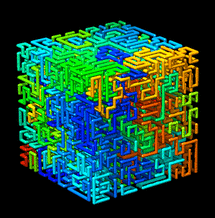
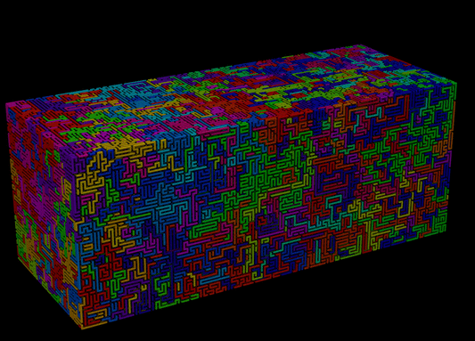
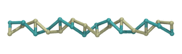

[]()
[]()


ndmansfield
===========

Usage:
```
ndmansfield -box xsize ysize zsize -tsave tsave [options] > traj.raw
```

Example:

```
ndmansfield -box 10 10 10 -tsave 2000 -tstop 20000 | tail -n 1001 > traj.raw
```

##  Description



"ndmansfield" is a simple program which
generates random self-avoiding space-filling curves
(also called "lattice Hamiltonian paths")
in an arbitrary number of dimensions 
using the algorithm developed by Marc L. Mansfield:
*(Mansfield, M.L., J. Chem Phys, 2006, 125(15):154103)*
The program runs a Monte-Carlo simulation
which generates a series of curves.  As the simulation progresses,
the curves become increasingly random and independent of the starting shape.
The coordinates for the shapes of these curves are saved as 3-column
(or n-column) numeric text files (eg "traj.raw") containing xsize\*ysize\*zsize
lines per curve, and blank lines as delimiters between new curves.
Cyclic curves can also be generated.  (See details below.)

The curves are assumed to be completely flexible,
however stiffness and twist preferences can be introduced
using the "-bend-energy" and "-twist-energy" arguments:



For more details, including a complete list of options, see the
[doc_ndmansfield.md file](doc/doc_ndmansfield.md).
(The move-set used during the Monte-Carlo procedure is explained
 [here](doc/images/Mansfield_monte-carlo_move_JCP2006_Fig1.png),
 and
 [here](doc/readme_motivation_and_introduction.pdf),
as well as in the Mansfield paper.)

NOTE: The initial shape of the curve is included in the file generated by this
program (which is *not* random).  To skip this useless shape and save only
the random shape at the end of the simulation, use "tail", to save the last N+1
lines of the file (as shown in the example above;
where N=xsize\*ysize\*zsize
and the +1 is for the trailing blank line delimiter.)

## Moltemplate interoperability

This program was originally used to generate initial 
coordinates for polymer melt simulations using
[MOLTEMPLATE](http://www.moltemplate.org "Moltemplate Homepage") and
[LAMMPS](http://lammps.sandia.gov "LAMMPS Home Page").
(The coordinates ndmansfield generates can be converted into arbitrary
polymers which trace the same path using the
"[genpoly_lt.py](https://github.com/jewettaij/moltemplate/blob/master/doc/doc_genpoly_lt.md)" and
"[interpolate_curve.py](https://github.com/jewettaij/moltemplate/blob/master/doc/doc_interpolate_curve.md)" scripts.
Below, a simple coarse-grained DNA polymer is wrapped along a curve generated by ndmansfield:

    

A detailed example demonstrating how this can be done can be found
[here](https://github.com/jewettaij/moltemplate/tree/master/examples/coarse_grained/DNA_models/dsDNA_only/2strands/3bp_2particles/confined_viral_DNA).
This [file](https://github.com/jewettaij/moltemplate/tree/master/examples/coarse_grained/DNA_models/dsDNA_only/2strands/3bp_2particles/confined_viral_DNA/STEP_1_generate_coords.sh)
explains how to download and run ndmansfield, choose the lattice size,
and scale and interpolate the coordinates to fit a polymer of a given
length inside a
[container of a given size](https://github.com/jewettaij/moltemplate/tree/master/examples/coarse_grained/DNA_models/dsDNA_only/2strands/3bp_2particles/confined_viral_DNA/images/DNA%2Bcapsid_cutaway_t%3D0_LR.jpg "DNA inside the HIV capsid").
This [file](https://github.com/jewettaij/moltemplate/tree/master/examples/coarse_grained/DNA_models/dsDNA_only/2strands/3bp_2particles/confined_viral_DNA/STEP_2_generate_LAMMPS_files.sh)
explains how to convert these coordinates into a polymer using
[genpoly_lt.py](https://github.com/jewettaij/moltemplate/blob/master/doc/doc_genpoly_lt.md) and
[moltemplate.sh](http://moltemplate.org "Moltemplate Homepage").
By running a [LAMMPS](http://lammps.sandia.gov) simulation,
the conformation of the polymer can be relaxed to get a
[more realistic conformation](https://github.com/jewettaij/moltemplate/tree/master/examples/coarse_grained/DNA_models/dsDNA_only/2strands/3bp_2particles/confined_viral_DNA/images/DNA%2Bcapsid_cutaway_not_equilibrated_LR.jpg "relaxed DNA inside the HIV capsid").
*(Note: The conformations generated by ndmansfield are typically entagled
(knotted). To obtain a truly equilibrium conformation, it may be
necessary to temporarily allow the polymer(s) to
[pass through itself](https://github.com/jewettaij/moltemplate/tree/master/examples/coarse_grained/DNA_models/dsDNA_only/2strands/3bp_2particles/confined_viral_DNA/README.md).)*


## Running Time

The total running time necessary to generate a random curve is estimated to be O(n^2).  (The number of iterations necessary to generate a random curve was estimated to grow as O(n) with the length of the curve.  The running time per iteration is O(n).  *(This can be improved significantly, but it is currently fast enough for my needs.)*  The curves shown above have a length over 300000  and were generated in a few minutes.


## Compilation

### Linux and Apple macOS:
```
cd src
source setup_gcc.sh
make
```
(If you are not using the bash shell, enter "bash" into the terminal beforehand.
 *Note: Apple users* will need to install the gcc compiler
 and other build tools using Xcode or brew.)

### Windows 10:

Install HyperV (with linux), or the Windows Subsystem for Linux (WSL) and run
```
sudo apt-get install build-essential
```
and then follow the instructions above.
(Older windows users can install Cygwin or MinGW, or linux via virtualbox.)


## Dimensionality:

ndmansfield can generate random paths in dimensions
other than 3 by changing the number of integers following the *-box* argument.

Example in 2-D:
```
ndmansfield -box 20 20 -tsave 1000 -tstop 15000 | tail -n 401 > traj.raw
```

Example in 4-D:
```
ndmansfield -box 10 10 10 10 -tsave 20000 -tstop 200000 | tail -n 10001 > traj.raw
```

(If you use the *-startcrd* argument, you will have to change the number of
columns in your file accordingly.)

## License

ndmansfield is available under the terms of the [MIT license](LICENSE.md).

